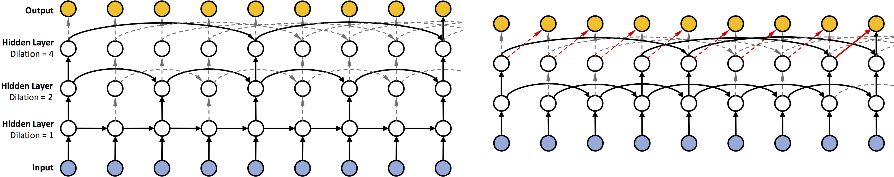

# Dilated Recurrent Neural Networks
Tensorflow implementation of [Dilated Recurrent Neural Networks](https://arxiv.org/abs/1710.02224) (DilatedRNN).

<p align="center">
    
</p>

For more about DilatedRNN, Please see our NIPS [paper](https://arxiv.org/abs/1710.02224).  If you find this work useful and use it on your own research, please cite our paper.

```
@article{chang2017dilated,
  title={Dilated Recurrent Neural Networks},
  author={Chang, Shiyu and Zhang, Yang and Han, Wei and Yu, Mo and Guo, Xiaoxiao and Tan, Wei and Cui, Xiaodong and Witbrock, Michael and Hasegawa-Johnson, Mark and Huang, Thomas},
  journal={arXiv preprint arXiv:1710.02224},
  year={2017}
}
```

## Getting Started
The light weighted demo demonstrates how to construct a multi-layer DilatenRNN with different cells, hidden structures and dilations for the task of permuted sequence classification on MNist.   Although most of the code is straightforward, we would like to provide examples for different network constructions.  

Below is an example that constructs a 9-layer DilatedRNN with vanilla RNN cells.  The hidden dimension is 20.  And the number of dilatation starts with 1 at the bottom layer and ends with 256 at the top layer.  

```python
cell_type = "RNN"
hidden_structs = [20] * 9
dilations = [1, 2, 4, 8, 16, 32, 64, 128, 256]
```

The current version of the code supports three types of cell: "RNN", "LSTM", and "GRU".   Of course, the code also supports the case where the dilation rate at the bottom layer is greater than 1 (as shown on the right hand side of figure 2 in our [paper](https://arxiv.org/abs/1710.02224)).


An example of constructing a 4-layer DilatedRNN with GRU cells is shown below.  The number of dilations starts at 4.  It is worth mentioning that, the number of dilations does not necessarily need to increase with the power of 2.  And the hidden dimensions for different layers do not need to be the same.  

```python
cell_type = "GRU"
hidden_structs = [20, 30, 40, 50]
dilations = [4, 8, 16, 32]
```

**Tested environment:**
Tensorflow 1.3 and Numpy 1.13.1.

## Final Words
That's all for now and hope this repo is useful to your research.  For any questions, please create an issue and we will get back to you as soon as possible.
